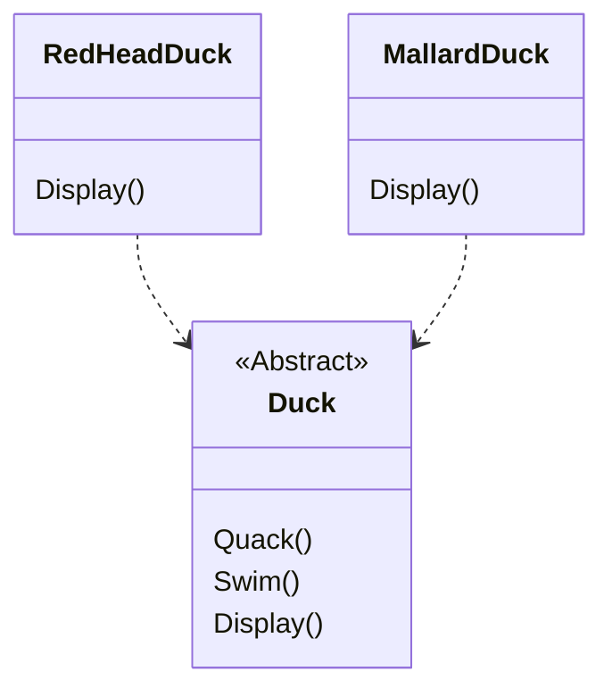
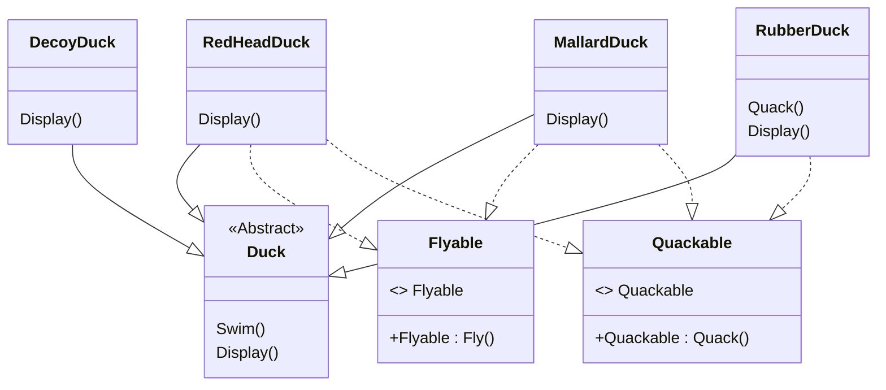
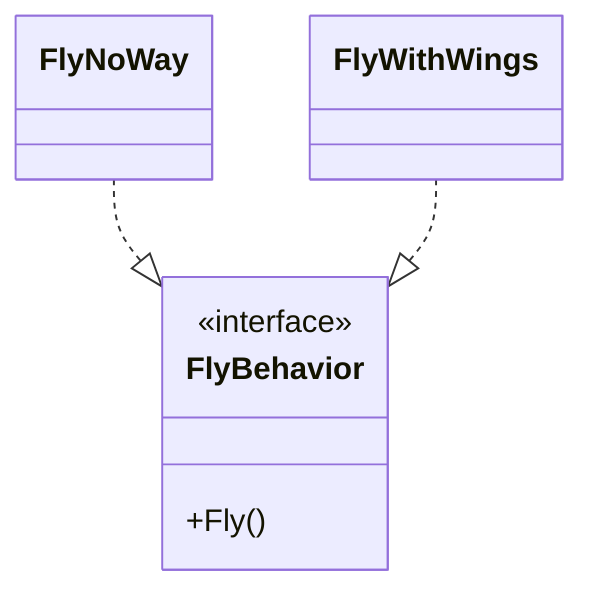
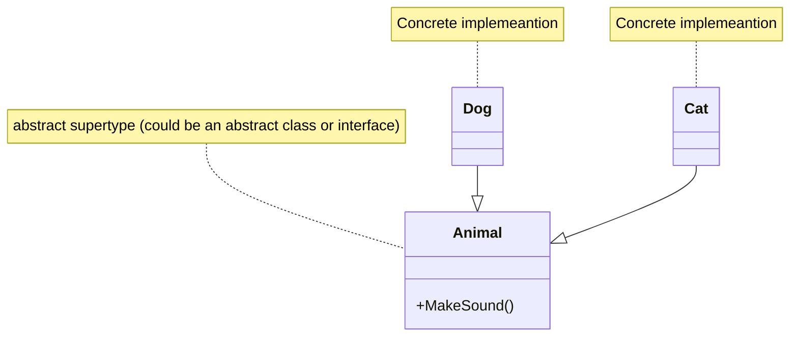
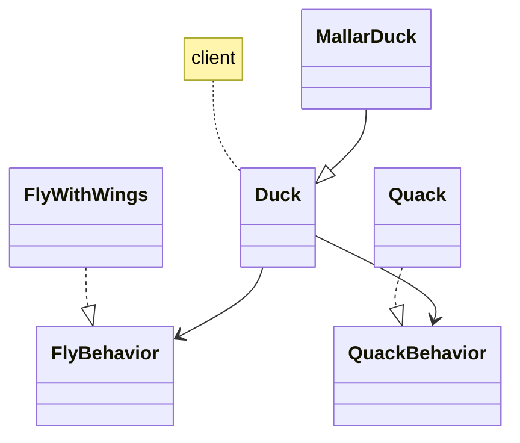
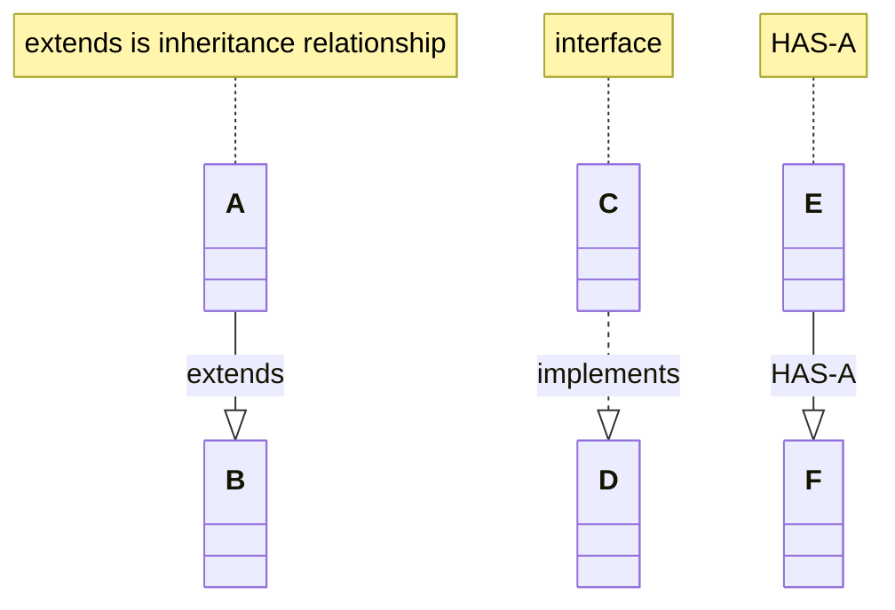
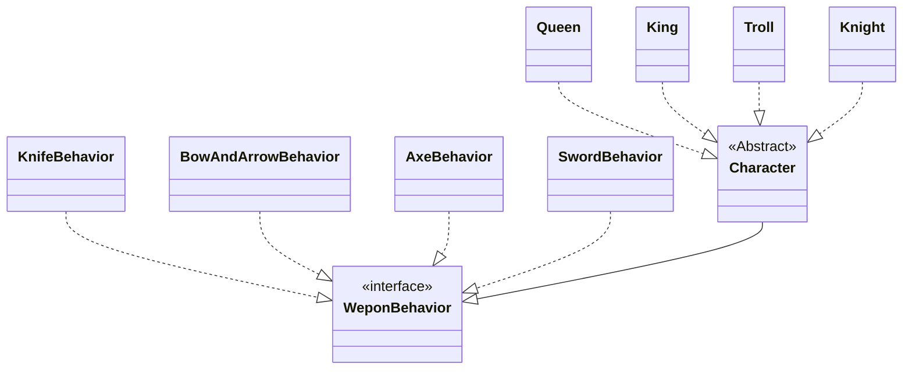

SimUDuck App



Approach 1 - Inheritance

Inheritance caused some problems

Answer
F - Changes can unintentionally affect other ducks.

Approach 2 - Interface

Inheritance is not the answer

Interface

Flyable - interface
fly()

Quackable - interface
Quack()



even interface is not the solution.

Destroys code reuse, and created other kinds of maintaince nightmare.

Change is constant

Design Prcinple - 1

Superation of concerns.
`    identify the aspects of your application that vary and seprate them from what stays the same.`

    Take what varies and "encapsulate" it so it won't affect the rest of your code.

    result :
    fewer unintended consequences from code changes and more flexibility in your systems!

`

pull out what varies.

`    separating what changes from what stays the same.`

Design Prcinple - 2

runtime.

more of abstraction i think.

`    Program to interface, not an implementation.`

from now on, The Duck behaviors will live in a separate class -
a class that implements a particular behavior interface.

thaty way, the duck class won't need to know any of the implementation details for their own behaviours.



program to interface = program to supertype

program to interface means program to a supertype.

example :

```c#

// Programming to an implemenation
/*
    Declaring the variable "d" as type
    Dog ( a concrete implemeantion of Animal)
    Forces us to code to a concrete implemeantion
*/
Dog d = new Dog();
d.Bark();

// programming to an interface or supertype

/*
    We know it's a Dog,
    But we can now use the animal reference polymorphically.
*/
Animal animal = new Dog();
animal.MakeSound()


// even better

/*

    rather than hardcoding the instantiation of the subtype into the code.
    like new Dog()

    assign the concrete implemenation object at runtime.

*/
a = getAnimal();
a.MakeSound();


```



implementing the duck behaviors

```mermaid
classDiagram


// todo

```

```c#
public abstract class Duck
{

    FlyBehavior flyBehavior;
    QuackBehavior quackBehavior;

    public duck() {}

    public abstract void display();

    public void perfromFly()
    {
        flyBehavior.Fly();
    }

    public void performQuack()
    {
        quackBehavior.Quack();
    }

    public void swim()
    {
        Console.WriteLine("All duck float, even decoys!");
    }

    public void setFlyBehavior(FlyBehavior fb)
    {
        flyBehavior = fb;
    }

    public void setQuackBehavior(QuackBehavior qb)
    {
        quackBehavior = qb;
    }
}


public interface FlyBehavior
{
    pubilc void Fly();
}


public class FlyWithWings : Fly
{
    public void Fly()
    {
        Console.WriteLine("I'm flying!!!");
    }
}

public class FlyNoWay : Fly
{
    public void Fly()
    {
        Console.Wrtieline("I can't fly");
    }
}

public class FlyRocketPowered : Fly {
    public void Fly() {
        Console.WriteLine("I'm flying with a rocket!");
    }
}

public interface QuackBehavior
{
    public void Quack();
}


public class Quack : QuackBehavior
{
    pubilc void Quack()
    {
        Console.WriteLine("Quack");
    }
}

public class MuteQuack : QuackBehavior
{
    pubilc void Quack()
    {
        Console.WriteLine("<< silence >>");
    }
}


public class Squeak : QuackBehavior
{
    public void Quack()
    {
        Console.WriteLine("Squeak");
    }
}

public class ModelDuck : Duck
{
    public ModelDuck()
    {
        flyBehavior = new FlyNoWay();
        quackBehavior = new Quack();
    }

    pubilc void Display()
    {
        Console.WriteLine("I'm a model duck");
    }
}

public classs MiniDuckSimulator
{
    pubilc static void Main(string[] args)
    {
        Duck mallard = new MallardDuck();
        mallard.PerformQuack();
        mallard.PerformFly();

        Dock model = new ModelDuck();
        model.PerformFly();
        model.SetFlyBehavior(new FLyRocketPowered());
        model.PerformFly();

    }
}
```

Ducks with dynamic behavior

The Big picture on encapsulation behaviors




HAS-A can be better than IS-A 


Design Principle - 3

`
        Favor composition over inheritance.
`




Design Puzzle



Your Design toolbox

OO Basics

Abstraction
Encapsulation
Polymorphism
Inheritance 

OO Prinpcles 

Encapsulate what varies.
Favor composition over inheritance
Program to interface, not implemeantion

OO Patterns

Strategy 
- 
defines a family of algorithms,
encapsulates each one,
and makes them interchangeable.

strategy let's the algorithm vary independently from clients that uses it.

Some good bullet points

* Knwoing the oo basics does not make you a good oo designer

* good oo design are 
    - reusable
    - extensible
    - maintainable

* patterns show you how to build systems with good oo design qualites. 

* patterns are proven OO experience.

* patterns dont give you code.
    they give you general solution to design problems.
    you apply them to your specific application.

* patterns aren't invented, they are discovered

* most patterns and principles address issues of change in software 

* we often try to take what varies in a system and encapsulate it.

* patterns provide a shared langauge that can  maximize the value of your communication with other developers.

---


