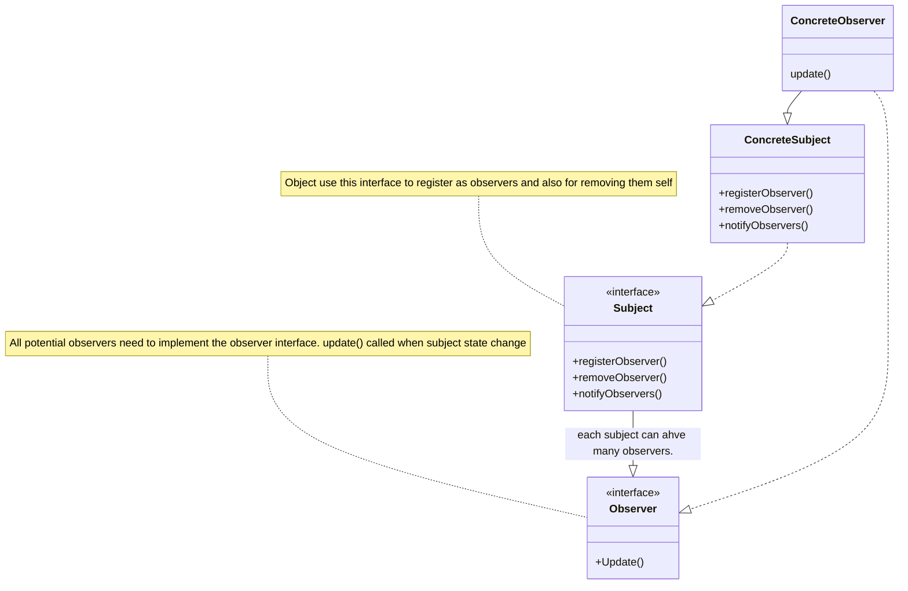
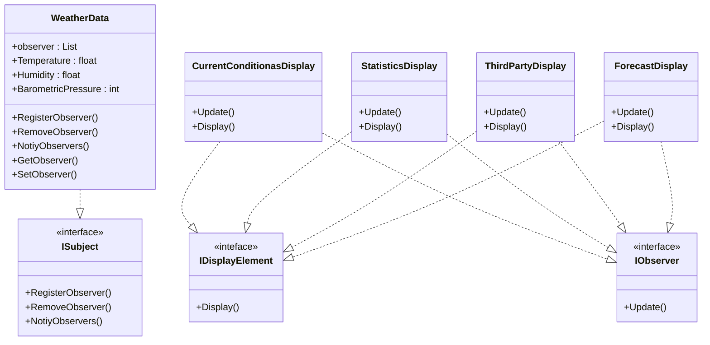

# The Observer pattern.

Requirements

Our Goal


Stretch Goal

constant in software development.
change

* Expandability.


question - 
A
B
C
E

OBSERVER PATTERN

news paper `example`

publishers + subscribers = observer pattern

publisher the SUBJECT

subscribers the OBSERVERS

subject object that manage some important data.

when the data in the subject is chagned,
the observers are notified.

The Observer Pattern
- defines a one-to-many dependency between objects so that when one object changes state.
- all of its dependents are notified and updated automatically.

one-to-many relationship

The observer pattern defines a one-to-many relationsip between a set of objects.

when the state of one object chagnes, all of it's dependencts are notified.


We have one subject, notifies many observers.
the observers dependent on the subject.


most revovle around a class design that includes Subject and Observer interfaces.




Loose copuling


when two objects are lossely copuled, 
They can interact,
but they typically have very little knowledge of each other. 


Loosely copuled designs often give us a lot of flexibility


Observer pattern is a greate example of loose copuling. 


Design Principle - 4

`
    Strive for lossely coupled designs between objects that interact
`

loosely coupled desgins allow us to build flexible OO systems

that can handle change because they minimize the interdependency between objects.





```c#

    public interface Subject {
        public void RegisterObserver(Observer o);
        public void RemoveObserver(Observer o);
        public void NotifyObserver(Observer o);
    }


    public interface Observer {
        public void update();
    }


    public interface DisplayElement {
        public void display();
    }

    public class WeatherData : ISubject  {
            private List<IObserver> observers;
            private float temparature;
            private float pressure;

            public WeatherData() {
                observers = new();
            }

            public void RegisterObserver(Observer o) {
                observers.Add(o);
            }


            public void RemoveObserver(Observer o) {
                observers.Remove(o);
            }

            public void NotifyObservers() {
                foreach(var observer in observers) {
                    observer.Update();
                }
            }

            public void MeasurementsChanged() {
                this.NotifyObservers();
            }

            public void setMeasurements(float temparature, float humidty, float pressure) {
                this.temparature = temparature;
                this.humidty = humidty;
                this.pressure = pressure;
                MeasurementsChagned();
            }
    }

    

    public class CurrentConditionsDisplay : IObserver, IDisplayElement  {
        private float temperature;
        private float humidity;
        private WeatherData weatherData;

        public CurrentConditionsDisplay(WeatherData weatherData) {
            this.weatherData = weatherData;
            weatherData.RegisterObserver(this);
        }

        public void Update()
        {
            this.temparature = weatherData.GetTemperature();
            this.humidty = weatherData.GetHumidity();
            this.Display();
        }

        public void Display()
        {
            Console.WriteLine("Current conditions: " + temperature + "F degrees and "  + humidty +  "% humidyt");
        }
    }


    public class WeatherStation {
        public static void main(string[] args) {
            WeatherData weatherData = new();

            CurrentConditionsDisplay currentDisplay = new(weatherData);

            weatherData.SetMeasurements(80, 65, 30.4f);
        }
    }
```


Design Principle Challenge


Identify the aspects of your application that vary 
and separate them from what stays the same.

Abstarction? Encapsualtion?

-  we get new displays 


Program to an interface, not an implementation
- program to supertype
- IObservers types.


Favor composition over inheritance
 - Subject is coposed of many observers.


