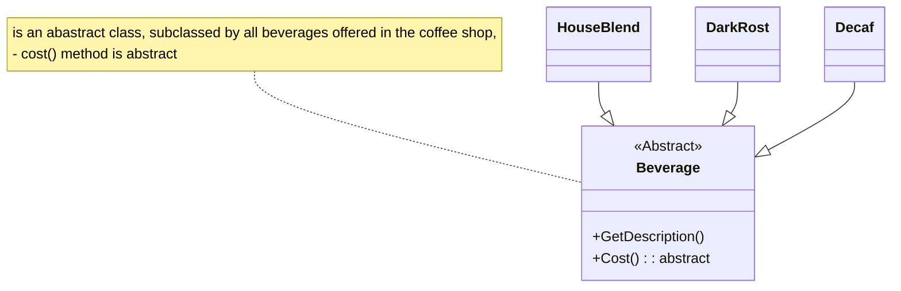

#  The Decortor Pttern


decorate your class at runtime using a form of composition.


give your or someone else object new responsibilities without makeing any code changes 
to the underlying classes.





violating design principles

`
    program to abstraction not concretion
`


the open-closed principle

`
    classes should be open for extension, but closed for modification
`


Goal : 
 - classes to be easily allowed to incorporate new behavior without modifying existing code.
- what does we get if we accomplish this? 
- designs that are resilient to change and flixible enough to take a new functionality to meet changing requirements.


while it may seem like a contradiction, 
there are thechinques for allowing code to be extended without direct modification.

be careful when choosing the areas of code that need to be extended.

`applying the open-closed principle everywere is wastfull and unnecessary, and can lead to copmlex, hard to understand code.`


confusion over inheritance vs composition

1 -
CondimentDecorator : Beveraege ? 

Decorator have the same type of object they are goign to decorate

for type matching not for behavior.


2 - 

compose a decorator with a component. 

we are adding new behavior


we get behavior not form inheriting from super class

but by composing objects together.


3 - 

object composition

4 - 

inheritance we can only be determined statically at compile time.
( we get only waterever behavior the superclass gives us to taht we override)

with composition we can mix and match decorators any way we like. `at runtime`

5 - 

Abstract class just works fine we can also implement it with an interface.


```c#
public abstract class Beverage {
    string description = "Unknown Beverage";

    public string GetDescription() {
        return description;
    }

    public abstract double cost();
}


public abstract class CondimentDecorator : Beverage {
    Beverage beverage;
    public abstract string GetDescription();
}


public class Expresso : Beverage {
    public Expresso() {
        description = "Expresso";
    }

    public double cost() {
        return 1.99;
    }
}

public class HouseBlend : Beverage {
    public HouseBlend() {
        description = "House Blend Coffee";
    }

    public double cost() {
        return .89;
    }
}

public class Moacha : CondimentDecorator {
    public moacha(Beverage beverage) {
        this.bevereage = beverage
    }

    public strting GetDescription() {
        return beverage.GetDescription() + ", Mocha";
    }

    public double cost() {
        return beverage.Cost() + .20;
    }
}


public class StarBuzzCoffee {
        public static void main(string args[]) {
            Beverage beverage = new Espresso();
            Console.WriteLine(bevereage.GetDescription() + " $" + beverage.Cost());

            Beverage beverage = new DarkRoast();
            beverage2 = new Moacha(Beverage2);
            beverage2 = new Mocha(Beverage2);
            beverage2 = new Whip(Beverage2);
            Consol.WriteLine(beverage2.GetDescription() + " $" + beverage2.cost());

            Beverage3 beverage3 = new HouseBlend();
            beverage3 = new Soy(beverage3);
            beverage3 = new Mocha(beverage3);
            beverage3 = new Whip(beverage3);
            Consol.WriteLine(beverage3.GetDescription() + " $" + beverage3.cost());
        }
}


```


